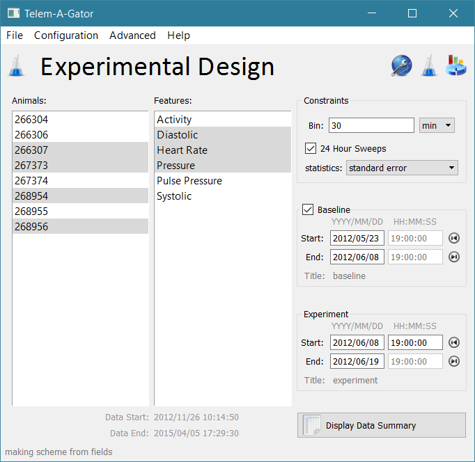
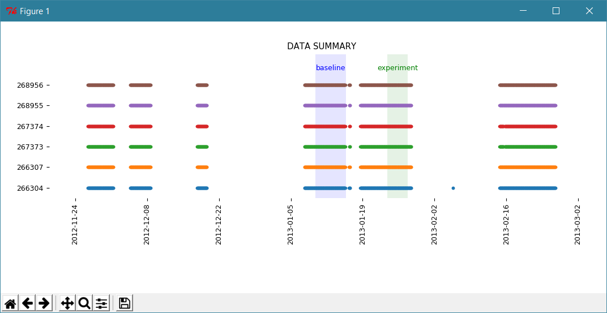
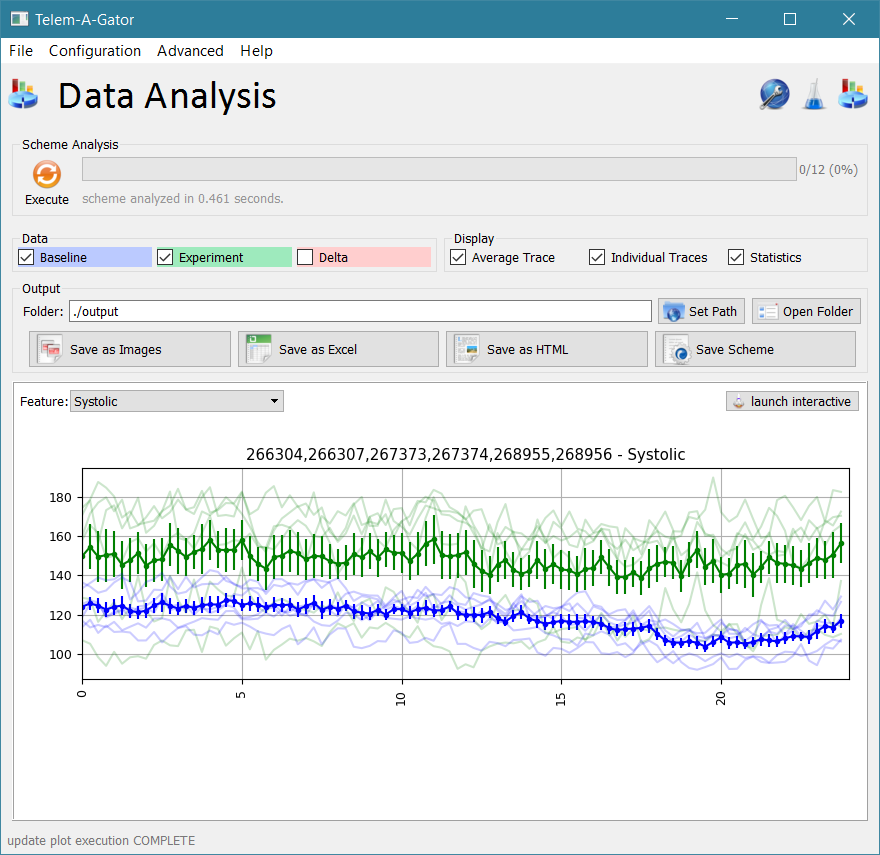
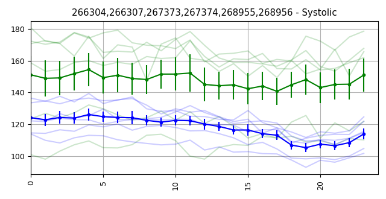
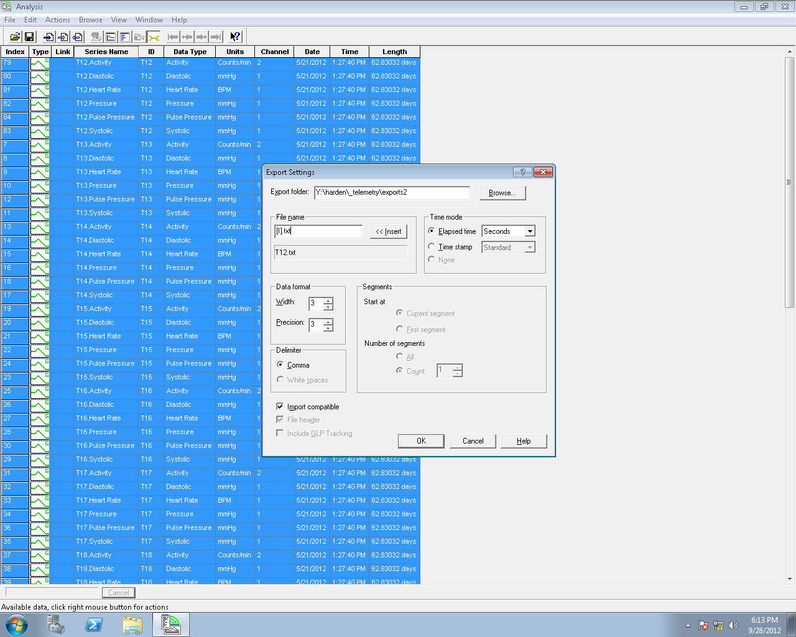

# Telem-A-Gator
**Telem-A-Gator is python-based GUI to view and analyze scientific telemetry data.** The goal of this software is to facilitate _exploratory data analysis_ rather than create publication figures. Any graph displayed in this software can be exported as PNG, JPG, and HTML files, and its content (the data creating it) can be exported as an excel file.

### Concepts
* This software is intentionally small. It was intended to be run on the laptop in the animal facility which records the telemtry data. This computer has a relatively small screen.
* The telemetry software outputs data in the form of massive text files (CSV format with .txt extension). Sample output is below.
* The raw text files are hundreds of megabytes in size. They are extremely slow to parse, especially over network drives. To speed up analysis time, an initial TXT->NPY conversion is performed. This produces hundreds of smaller NPY files which are already memory-mapped in a format Python can load rapidly. 
* This software uses _schemes_ to define an experiment.
  * A scheme is like "compare the average [systolic pressure and heart rate] of animals [A, B, C] at different times of the day from dates [startDate - endDate] subtracting-out a baseline date range [startDate - endDate] and shuffle the data into [15 minute] bins and report error as [standard deviation].
  * A scheme can be saved (or loaded) as an INI file.
  * An example is [scheme_default.ini](src/scheme_default.ini)
  * A scheme can be saved, then loaded and re-run at a later date. This is useful when new data becomes available (the only element that changes is the date range)
  * Perhaps the most useful "feature" of this software is the ability to rapidly include/exclude animals from groups.

### Installation
_NOTE: It was a MASSIVE undertaking to get this software running again several years later. The basic reason is that WinPython does not ship with PyQt, and to use the old version no newer versions can be installed on the system. Traditionally this was done with PythonXY, but that software is no longer available online. I got it working with WinPython, but its different version of numpy required code changes. It works now (2017-10-30) on a Windows 10 machine so follow these instructions carefully. There is almost no flexibility for other versions of Python or supporting libraries._

* install [WinPython-64bit-2.7.12.4Zero](https://sourceforge.net/projects/winpython/files/WinPython_2.7/2.7.12.4/) locally
  * It helps to have full file access to the install path. I recommend installing it in Documents.
  * `C:\Users\swharden\Documents\important\WinPython-64bit-2.7.12.4Zero` (for me)
  * You do not have to set the user or system environment variables to add python.exe to the system path.
* install [PyQt4-4.11.4-gpl-Py2.7-Qt4.8.7-x64.exe](https://sourceforge.net/projects/pyqt/files/PyQt4/PyQt-4.11.4/) into the WinPython sub-folder containing python.exe
  * During the installation screen it asks to locate Python's installation folder. 
    * Give it the the full path to python.exe. This will be similar to the path above, but one folder deeper
    * `C:\Users\swharden\Documents\important\WinPython-64bit-2.7.12.4Zero\python-2.7.12.amd64` (for me)
* Install additional libraries
  * open `WinPython Command Prompt.exe` (in the WinPython folder)
  * `python -m pip install --upgrade pip` (to upgrade pip)
  * `pip install numpy` (to install [numpy](http://www.numpy.org))
  * `pip install matplotlib` (to install [matplotlib](http://matplotlib.org))
* Create a batch script to launch the telem-a-gator
  * The easiest thing to do is just edit [src/LAUNCH.cmd](src/LAUNCH.cmd) on your own computer.
  * Then just `"C:\path\to\python.exe" TELEM-A-GATOR.py`
  * Add `pause` to the end of the script to prevent it from closing if it crashes.
  * This can be made an icon on the desktop (make a shortcut to the batch script, not another batch script)
    
### Example Use
_Run through this set of steps to demonstrate how this software runs_
* ***Data Conversion:*** Data has to be converted from TXT files to NPY files.
  * Go to the _data path configuration_ screen. Instructions are at the top.
  * I like to make my output folder the same as my input folder.
  * Click convert, and hundreds of smaller NPY files will be created.
* ***Experiment Design:***
  * If no animals show up, go back to the data conversion screen and set the data folder
  * Design your experiment here. TODO: document what all the boxes do.

### Screenshots
description|screenshot
---|---
The data path configuration screen lets to convert the raw telemetry files from text file format to NPY format (much faster to load from disk into memory) | 
The experimental design screen lets you define animal groups, date ranges, etc. This is the scheme designer and editor. All data here can be saved as a scheme and loaded again in the future. | 
The data summary window launches if you click the button on the lower right of the experimental design screen. It shows you the date ranges of all data available for each window. It also shows you the baseline ane experiment region currently set. It's a good way to see what animals' data is available when, and also provide a sanity check for the date ranges you want to analyze. | 
There are many forms of graphical output. The best way to see them is to play with the software. This is the data output screen. The graph window is small, but can be opened in a larger resizable window. Also, since all the data can be exported in various formats, visualizing it inside the program isn't very important. | 
When exporting as PNG, image files are stored in the output folder. The _intent_ of this program is to use graphs like these to get an idea if your experiment worked. If it did, use the _data_ in the output folder (CSVs) to create graphs like this in your favorite graphing program. These PNG and JPG images are never intended to be published directly. | 

### Miscellaneous
* **Licensing:** At one point long ago there was talk about providing Telem-A-Gator with CJFLab software (which Dr. Frazier wrote and distributes as pay-for software with a licensing system to protect it). I included licensing support inside Telem-A-Gator but it is not activated and can be effectively ignored for now. Licensing a collection of plain text python scripts is a weird concept to me. I think the plan was to have this program run as a combination of Python and C such that the licensing system would use that already available in C.
* **matplotlibwidget error** (if occurs) can be prevented by placing matplotlibwidget.py in to WinPython's ./lib/site-packages/ folder. Alternatively just make sure that file is in the same folder you are launching python from (i.e., the folder with the batch script).

### Telemetry File Format
* Example data is in [/data/](/data/)
* There is a small header, then data is traditional CSV.
* Files can be hundreds of megabytes in size

```
# File created 2013/05/13 14:18:59 Eastern Daylight Time (UTC -0400)
# Time: 2012/11/26 10:14:50
# UTC: 2012/11/26 15:14:50
# Period: Seconds
# Col: 267373.Pulse Pressure,267373,1,Pulse Pressure,mmHg
# Col: 267373.Systolic,267373,1,Systolic,mmHg
# Col: 267373.Pressure,267373,1,Pressure,mmHg
# Col: 267373.Heart Rate,267373,1,Heart Rate,BPM
# Col: 267373.Diastolic,267373,1,Diastolic,mmHg
# Col: 267373.Activity,267373,2,Activity,Counts/min
0,30.880,134.175,119.304,531.135,103.295,0.000
10,29.904,134.123,119.747,539.591,104.280,0.000
20,30.362,134.604,119.549,511.399,104.242,0.000
30,29.858,134.675,119.911,509.528,104.762,0.000
40,29.361,135.060,120.861,526.790,106.108,0.000
50,25.648,130.785,118.961,695.613,105.292,0.000
60,25.546,137.320,125.278,712.946,112.232,6.000
70,26.374,140.087,127.435,692.260,113.753,0.000
80,26.847,142.985,129.909,675.199,116.575,0.000
90,26.237,143.769,131.534,705.232,117.630,0.000
100,25.722,147.578,134.931,713.224,121.574,0.000
110,25.924,147.309,134.263,720.641,121.340,0.000
120,24.191,129.820,117.820,745.614,105.741,12.000
130,26.345,133.677,121.262,755.374,107.194,24.000
```

##### Oh yeah, you must export it like this in the telemetry software:


### History
* **April 2013 - creation:** I wrote this software within the first month of joining the Frazier laboratory. I had just finished my third rotation and was about to start studying compound 21. I did not yet have a clear PhD project, so I spent some free time learning PyQt by creating this software. I was not asked to create this software by anyone, and its purpose was for me to learn some new programming skills. I got the idea after seeing how much effort was going into  telemetry analysis by another graduate student (Lei) and decided to try to come up with something which might be useful. Development of this project ended within a couple weeks of it starting, and it was presented to Lei in May 2013. I don't think it had the flexibility of analysis he would have benefited from, and to my knowledge it was not used for scientific analysis at this time. _However, the programming techniques I learned allowed me to create the [Scan-A-Gator](https://github.com/swharden/two-photon/tree/master/software/linescan-analysis) which was useful for real-time calculation of calcium imaging data from two-photon linescans._
* **November, 2016 - renewed interest:** A request was made to get this software running again, as there was renewed interest in using it (I think because the student who worked on this previously using Excel had recently graduated). I was able to get it up rapidly with a carefully crafted WinPython distribution. The software could only be distributed _with_ the python distribution (gigabytes in size). To my knowledge, the software was not extensively used at this time.
* **October, 2017 - renewed interest:** A request was made to get this software running again. I had the source code but no longer had access to the preconfigured Python distribution (on the Y drive) which allowed it to run. I instead got it to work from a scratch installation of WinPython such that it can be run on a system with multiple versions of Python and PyQT. Due to changes in numpy, some source code required modification. After getting it up, I documented its installation procedure here.
